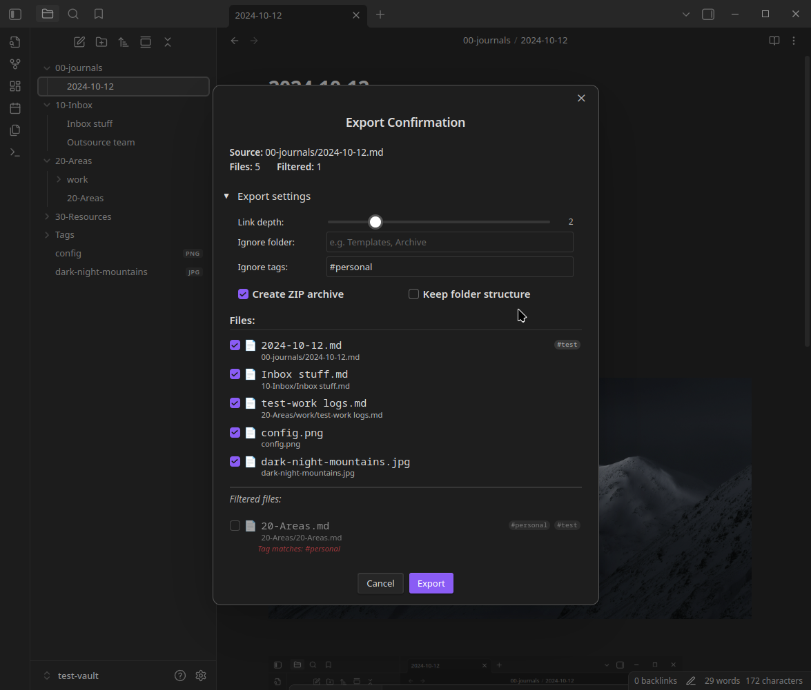
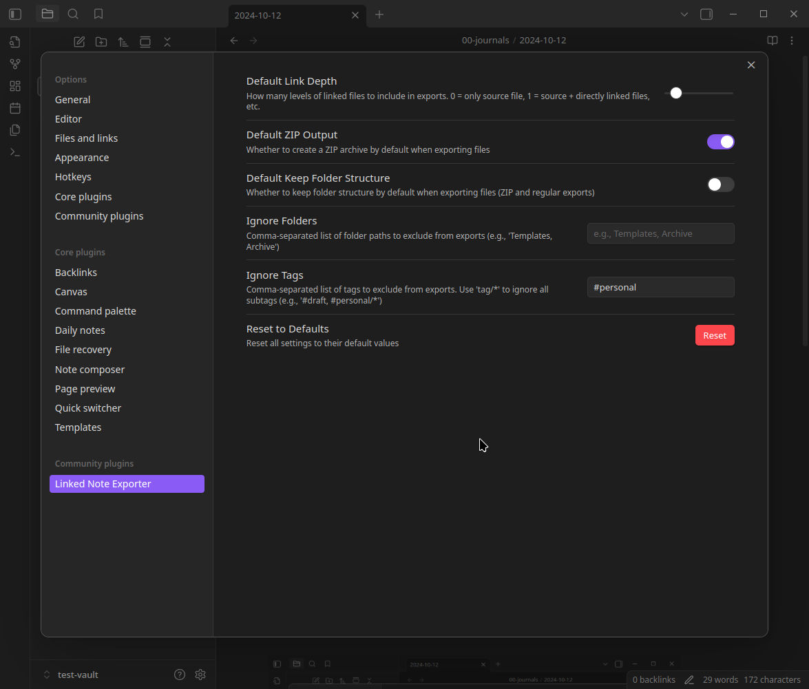

# Linked Note Exporter

Export a note along with all its attachments and linked notes—cleanly, conveniently, and outside your vault so you can share it with others.

## ✨ Features

-   Export a note to a directory outside your vault
-   Include all embedded/linked files (images, PDFs, etc.)
-   Include notes linked from the source note, up to configurable link depth
-   Organize exported files by document header structure (H2, H3, etc.)
-   Optionally zip the export
-   Exclude notes by folder or tag
-   Trigger from the **right-click context menu** or **command palette**

## 🛠️ Use Case

You’ve crafted a beautiful note with images and cross-links—but sharing it with a colleague becomes a tangled mess of missing files and broken links. This plugin solves that elegantly by exporting a self-contained bundle of everything related to that note.

## 🖼️ Screenshots







## ⚙️ Settings

### `Link Depth`

-   Determines how many levels of linked notes are exported.
-   `1` includes directly linked notes.
-   `2` includes notes linked by those notes, and so on.

### `Zip Export`

-   If enabled, the exported files will be zipped into `export.zip` inside the target directory.

### `Keep Folder Structure`

-   If enabled, the export files or zip will maintain the same directory structure as the original file path.
-   **Note**: This is mutually exclusive with `Use Header Hierarchy`.

### `Use Header Hierarchy`

-   If enabled, exported files are organized by the header structure of the source note.
-   Headers (H2, H3, H4, etc.) become directories, and linked notes are placed under their respective header sections.
-   Creates a clear, semantic folder structure that mirrors your document's outline.

#### Example

**Source Note** (`Project Overview.md`):
```markdown
# Project Overview

## Research
- [[Literature Review]]
- [[Data Sources]]

## Implementation
### Backend
- [[API Design]]
- [[Database Schema]]

### Frontend
- [[UI Components]]
```

**Exported Structure**:
```
Project Overview/
├── Research/
│   ├── Literature Review.md
│   └── Data Sources.md
└── Implementation/
    ├── Backend/
    │   ├── API Design.md
    │   └── Database Schema.md
    └── Frontend/
        └── UI Components.md
```

### `Ignore Folders`

-   Notes located in these folders will be skipped during export.
-   Useful for ignoring private, work-related, or archival material.

### `Ignore Tags`

-   Notes with these tags will be skipped.
-   Supports wildcards:
    -   `#personal/*` excludes tags like `#personal/notes`, `#personal/thoughts`, etc. This also excludes `#personal`.
    -   `#private` by itself excludes that tag only.

## 🧭 How to Use

-   **Right-Click Export**: Right-click any markdown file in the file explorer → `Export with Linked Content`
-   **Command Palette**: Trigger `Export Note with Linked Files`

## 🧪 Install from community plugin list

1. Open Settings.
2. Select Turn on community plugins.
3. Select Browse to list all available community plugins.
4. Search for "Linked Note Exporter" and click install.
5. Enable the plugin from the Community Plugins list.

## 📁 Export Output

-   All selected notes and attachments will be copied to your chosen directory
-   Internal links are updated to ensure integrity
-   Optionally zipped if the setting is enabled

### Export Modes

The plugin offers three ways to organize your exported files:

1. **Flat Export** (default): All files in a single directory
2. **Vault Structure**: Preserves the original folder hierarchy from your vault
3. **Header Hierarchy**: Organizes files by the document's header structure (H2, H3, etc.)

Choose the mode that best fits your sharing or archival needs.

## 📌 Roadmap / TODO

-   More link handling options (e.g., block links)
-   CLI integration (?)

## 🧑‍💻 Author

Crafted by someone who just wanted exporting notes to _work_.
Use it, fork it, improve it.

## 📄 License

This plugin is released under the MIT License.

## ☕ Support This Plugin

If this plugin saved you some time—or your sanity—you can buy me a coffee:

<https://buymeacoffee.com/the.c0d3r>

Your support helps keep the keyboard clicking and the plugins flowing.
